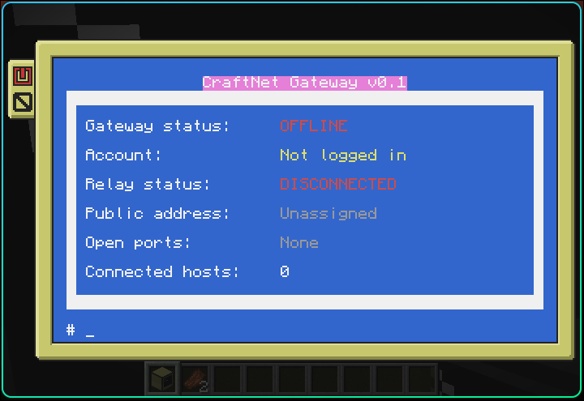

# CraftNet

CraftNet is a low-level networking layer for **CC:Tweaked** computers: gateways, virtual ports, addresses, and request/response protocols that other programs can build internet-like applications on top of. It is not itself a browser or a set of apps — it is the plumbing.

A **Gateway** computer bridges Minecraft's in-world Rednet network to an external relay over a persistent WebSocket connection. That relay is meant to let gateways on different Minecraft servers exchange packets, register human-readable addresses, and expose virtual ports to each other. A **Host** computer reaches that same network indirectly, through a Gateway, over Rednet.

CraftNet is in active development. The Gateway and Host client software is functional end-to-end against a public WebSocket echo server used for protocol testing. The real CraftNet relay server — the backend the echo server currently stands in for — has not yet been built.

## Installing

Place `bootstrap.lua` on a fresh CC:Tweaked computer as `/bootstrap.lua` and run it. It will:

1. Ask whether the computer is a **Gateway** or a **Host** (or accept `bootstrap gateway` / `bootstrap host` as an argument), and remember the choice in `/craftnet-data/install-role.lua`.
2. Install `/startup.lua` so CraftNet starts automatically on every boot.
3. Pull the current `src/` tree for that role straight from GitHub and install it to `/craftnet`, replacing the previous install atomically (with rollback if the download or install fails).
4. Launch the role's program — `main.lua` for a Gateway, `host.lua` for a Host.

Because it re-syncs from GitHub on every boot, a CraftNet computer always runs the latest code without any manual file copying.

## Requirements

- Minecraft with CC:Tweaked
- HTTP and WebSocket access enabled for CC:Tweaked (Gateway role)
- Access to a compatible WebSocket relay
- A wireless or wired modem, for:
  - Every Host computer (its only path to a Gateway)
  - Any Gateway that needs to serve local Hosts

An advanced computer is recommended for the Gateway's color dashboard.

## Gateway

The Gateway is the computer with real internet access. It owns the relay connection, the port routing table, domain registration, and the registry of local Hosts connected to it over Rednet.

### Dashboard


```text
Gateway status
Account
Relay status
Public address
Open ports
Connected hosts
```

The top status bar also shows live relay reachability (`RELAY:`) and modem state (`MODEM:`), independent of whether a persistent connection is currently open.

#### Gateway status

| Status | Meaning |
|---|---|
| `OFFLINE` | The gateway is disabled and refuses CraftNet traffic. |
| `STARTING` | The gateway is enabled but has not completed the relay handshake. |
| `ONLINE` | The relay has accepted the gateway's `hello` and answered with a `welcome`. |

#### Relay status

| Status | Meaning |
|---|---|
| `DISCONNECTED` | No WebSocket connection exists. |
| `CONNECTING` | The gateway is attempting to open a WebSocket connection. |
| `CONNECTED` | A WebSocket connection is open and has completed the handshake. |

A connected WebSocket does not, on its own, mean the gateway is fully online — see the status table above.

### Gateway commands

```text
gateway enable            Enable the gateway (status becomes STARTING)
gateway disable            Local kill switch: disables the gateway,
                            closes the relay connection, refuses new traffic
gateway status              Show the current gateway status
```

### Relay commands

The relay URL lives in persistent settings, not in source, so it can be changed without editing CraftNet's code.

```text
relay show                                 Show the configured relay URL
relay set <ws://... | wss://...>            Change it (relay must be disconnected first)
relay test                                  One-shot echo test: connect, send a
                                             unique string, confirm it comes back, close
relay connect                               Open the persistent connection and perform
                                             the CraftNet handshake (gateway must be enabled)
relay disconnect                            Close the persistent connection
relay status                                Report whether a persistent connection is open
relay ping                                  Send a CraftNet protocol ping over the
                                             persistent connection
relay last [rejected]                       Show the last valid message received, or the
                                             last packet the gateway itself rejected
relay send <address> <port> <message>       Send a raw packet through the relay
```

The current development default relay is `wss://example.tweaked.cc/echo` — a public echo server used to validate the protocol, not a real CraftNet relay.

### Domain commands

A domain is a human-readable CraftNet address (always ending in `.craft`) that a relay can bind to a gateway's connection, replacing an opaque assigned address.

```text
domains register <domain> [registration-key]   Register a domain with the relay
domains clear <domain> [management-key]        Release a domain
```

If a key isn't given on the command line, CraftNet prompts for it without echoing input. A successful registration's management key is saved locally (`/craftnet-data/settings.lua`) so future `domains clear` calls don't require re-entering it.

### Port commands

CraftNet ports are virtual application ports carried inside the CraftNet protocol — not Minecraft server ports, router ports, or physical TCP ports. A single WebSocket connection can carry traffic for many CraftNet ports at once, so nothing needs to be forwarded at the router level.

```text
ports open <port>                        Open a port, routed to this gateway
ports route <ext> to <int> <computerId>  Open a port, routed to a specific local
                                          host's internal port over Rednet
ports close <port|all>                   Close one port, or every open port
ports list                               List the routing table as text
ports table                              Show the routing table in the dashboard
```

`port`/`port open ...` also works as a singular alias for `ports`/`ports open ...`. Valid port numbers are `1`–`65535`.

Opening a port with just `ports open <port>` routes inbound traffic on that port to the gateway itself (no local service currently binds gateway-hosted ports — that path is reserved for future use). `ports route <external> to <internal> <computerId>` is how a Gateway forwards a public port to a specific Host computer's internal port, translating the packet into a local Rednet delivery for that host.

### System commands

```text
system clear      Clear the current notice and redraw the dashboard
system term        Drop into a normal CraftOS shell inside CraftNet
system reboot       Reboot the computer
system shutdown     Shut down the computer
```

Typing `exit` at any time closes the relay connection and leaves CraftNet back to the CraftOS shell.

### Gateway quick test

A minimal sequence to confirm the client-side protocol path end-to-end against the public echo server:

```text
gateway enable
relay show
relay test
relay connect
relay ping
relay last
gateway disable
```

Expected state after `relay connect`: `Gateway status: STARTING`, `Relay status: CONNECTED` (the echo server can't complete a real handshake, so the gateway never reaches `ONLINE`). Expected result after `relay last`: `Last message: pong [message-id]`. After `gateway disable`: both statuses back to `OFFLINE`/`DISCONNECTED`.

## Host

A Host computer has no direct internet access and reaches CraftNet only through a Gateway over Rednet. Installing the Host role runs a small always-on network manager (`cnetd`) in the background alongside a completely normal CraftOS shell — the daemon and the shell run concurrently, and CraftNet adds itself to the shell's program path so the `cnet` command works from any prompt.

The daemon handles reconnecting to its configured gateway automatically and sends a periodic heartbeat ping; nothing needs to be kept running manually.

### `cnet` command reference

```text
cnet connect <gateway ID>                        Connect to a gateway over Rednet
cnet disconnect                                    Forget the configured gateway
cnet status                                        Show this host's CraftNet status
cnet ping                                          Ping the configured gateway
cnet send <address> <port> <message>               Send a one-way packet
cnet request <address> <port> <message>            Send a packet and wait for a response
cnet reply <message>                               Answer the last received packet or request
cnet listen <port>                                 Start accepting packets on an internal port
cnet unlisten <port>                                Stop listening on an internal port
cnet listeners                                     List the ports currently being listened on
cnet receive <port> [timeout]                       Wait for and return the next packet on a port
cnet last                                          Show the last accepted packet
cnet last rejected                                 Show the last packet the daemon rejected, and why
```

### `cnet` developer API

Other CC:Tweaked programs on the same computer can skip the CLI entirely and call the same functionality directly:

```lua
local cnet = require("lib.cnet")

local response, requestError = cnet.request("alice.craft", 80, "hello")
```

The API and the CLI both talk to the same `cnetd` daemon, so `cnet listen`/`cnet receive` from the shell and `cnet.listen`/`cnet.receive` from a program can interoperate on the same host.

### Host quick test

```text
cnet connect <gateway computer ID>
cnet status
cnet ping
```

Expected result after `cnet connect`: `Connected to gateway ID <id> as <public address>.` `cnet status` then reports `Connection: ONLINE` and the assigned public address; `cnet ping` reports the gateway's round-trip time in milliseconds.

## CraftNet Protocol

CraftNet actually defines two related JSON protocols, sharing one envelope shape.

### Message envelope

```json
{
  "protocol": "craftnet",
  "version": 1,
  "type": "ping",
  "id": "0-1784566449002-1",
  "payload": {
    "sentAt": 1784566449002
  }
}
```

`id` is always `computerId-epochMillis-counter`, guaranteeing uniqueness even for multiple messages created in the same millisecond on the same computer.

### Public protocol (`craftnet`, Gateway ↔ relay, over WebSocket)

```text
hello               welcome
packet              request / response
domain_register     domain_registered
domain_clear        domain_cleared
error
ping / pong
```

- **`hello`** — sent when opening the relay connection. Carries the gateway's computer ID, client version, and a per-install `gatewayKey` (a 32–128 character secret generated once at first run and stored in `/craftnet-data/settings.lua`) that authenticates the gateway to the relay.
- **`welcome`** — the relay's acceptance of a `hello`, carrying a session ID and the gateway's assigned public address. Only a valid `welcome` should move a gateway from `STARTING` to `ONLINE`.
- **`packet`** — one-way routed traffic between two CraftNet addresses and ports.
- **`request`** / **`response`** — a two-way exchange correlated by a `returnToken` (an 8–64 character opaque string) rather than by the transport connection itself, so a response can be routed back to the correct Host even though it arrives asynchronously.
- **`domain_register`** / **`domain_registered`**, **`domain_clear`** / **`domain_cleared`** — binding and releasing a `.craft` address, gated by registration/management keys.
- **`error`** — reports a protocol or delivery failure (see error codes below).
- **`ping`** / **`pong`** — liveness check; a gateway automatically answers valid incoming pings.

### Local protocol (`craftnet-local`, Gateway ↔ Host, over Rednet)

```text
hello / welcome
outbound / deliver
request / response / return_delivery
error
ping / pong
```

This is the protocol Hosts and Gateways speak to each other over Rednet — it never leaves the local Minecraft network. A Host says `hello` to register with a Gateway; the Gateway answers `welcome`. `outbound` is a Host asking its Gateway to relay a packet outward; `deliver` is the Gateway handing an inbound public `packet`/`request` to the right Host. `request`/`response` mirror the public protocol's return-token exchange for two-way local traffic, and `return_delivery` is how a Gateway hands a Host its response once the return trip completes. Message shapes for `request`, `response`, and `deliver` embed a full public-protocol message inside their payload and validate it against the public protocol's own rules.

### Error codes

Errors seen in practice today include:

```text
PORT_CLOSED             ID_MISMATCH               NOT_REGISTERED
GATEWAY_DISABLED        RELAY_OFFLINE             RELAY_SEND_FAILED
SERVICE_UNAVAILABLE     MODEM_MISSING             HOST_UNAVAILABLE
INVALID_PUBLIC_REQUEST  RETURN_SESSION_REJECTED   WRONG_DESTINATION
UNKNOWN_RETURN_TOKEN    RETURN_SOURCE_MISMATCH    RETURN_PORT_MISMATCH
ROUTING_FAILED          UNSUPPORTED_LOCAL_MESSAGE
```

## Virtual Ports Versus Internet Ports

CraftNet virtual ports are not physical internet ports. The gateway makes exactly one outbound WebSocket connection:

```text
Gateway
   │
   │ WSS connection
   ▼
Relay server on TCP 443
```

Many virtual CraftNet services can eventually share that one connection:

```text
CraftNet port 12 → mail service
CraftNet port 21 → file service
CraftNet port 80 → web service
```

No router port forwarding is required, because the gateway always initiates the connection outward.

## Persistent Settings

Gateway settings live at `/craftnet-data/settings.lua`:

```text
Gateway enabled state       Relay URL              Open ports (routing table)
Gateway status               Relay status            Account state
Public address                Registered domain       Domain management keys
Gateway authentication key
```

Host settings live separately at `/craftnet-data/host.lua`:

```text
Configured gateway ID     Auto-connect preference
Request/heartbeat timing   Listening ports
```

Live connection and relay/modem health statuses are always recomputed at startup — a stale saved value must never cause the interface to claim a disconnected gateway is still online.

## Project Structure

```text
craftnet/
├── bootstrap.lua
├── dev-startup.lua            (gitignored, local dev only)
└── src/
    ├── main.lua                Gateway entry point
    ├── host.lua                 Host entry point (daemon + shell)
    ├── cnetd.lua                 Host network-manager daemon
    ├── cnet.lua                   Host `cnet` shell command
    ├── config.lua
    ├── commands/
    │   ├── domains.lua
    │   ├── gateway.lua
    │   ├── port.lua
    │   ├── relay.lua
    │   └── system.lua
    ├── lib/
    │   ├── cnet.lua              Host developer API (used by cnet.lua and other programs)
    │   ├── command.lua           Gateway command dispatcher
    │   ├── local_gateway.lua     Gateway-side handling of local Host traffic
    │   ├── local_protocol.lua    Local (Rednet) protocol
    │   ├── modem.lua             Rednet/modem lifecycle
    │   ├── protocol.lua          Public (relay) protocol
    │   ├── relay.lua             WebSocket relay connection and routing
    │   ├── return_sessions.lua   In-flight request/response tracking
    │   ├── router.lua            Inbound packet routing to local hosts
    │   ├── routes.lua            Port routing table
    │   ├── settings.lua          Gateway persistent settings
    │   ├── ui.lua                Gateway dashboard
    │   ├── message_protocol.lua  Shared JSON envelope used by both protocols
    │   ├── validate.lua          Shared field validators (ports, IDs, addresses)
    │   ├── tokens.lua            Return-token generation and validation
    │   └── ids.lua               Shared message/request ID generator
    └── assets/
        └── logo.nfp
```

`lib/message_protocol.lua`, `lib/validate.lua`, `lib/tokens.lua`, and `lib/ids.lua` are the shared low-level pieces both protocols and both roles are built from — the intended reuse surface for anything else layered on top of CraftNet later.

## Roadmap

### Gateway foundation

- [x] Full-screen management dashboard
- [x] Persistent settings
- [x] Gateway enable and disable commands
- [x] Local gateway kill switch
- [x] Virtual port configuration
- [x] Configurable relay URL
- [x] WebSocket echo testing
- [x] Persistent WebSocket connection
- [x] Concurrent console and relay loops
- [x] JSON protocol encoding
- [x] Protocol validation
- [x] Unique message IDs
- [x] Ping and pong handling

### Relay and routing

- [ ] Build the CraftNet relay server
- [x] Send `hello` after connecting, authenticated with a gateway key
- [x] Receive and validate `welcome`
- [x] Promote authenticated gateways to `ONLINE`
- [x] Register and release human-readable domains
- [x] Two-way `request`/`response` traffic with return-token routing
- [x] Enforce destination ports against the routing table
- [x] Return protocol errors for rejected traffic
- [x] Automatic reconnect and heartbeat for Host ↔ Gateway (Rednet)
- [ ] Automatic reconnect for Gateway ↔ relay (WebSocket) — currently manual via `relay connect`
- [ ] Route packets between two separate gateways through a real relay server

### Local networking

- [x] Detect an attached modem
- [x] Accept connections from local ComputerCraft hosts
- [x] Route relay packets to local hosts
- [x] Track connected hosts
- [x] Route a public port to a specific host's internal port
- [x] Host-side daemon, shell integration, and developer API (`cnet`)
- [ ] Allow a service running on the gateway itself to bind a CraftNet port

## Version

Current development version: CraftNet v0.1

CraftNet is experimental software and is not yet ready for production use.
